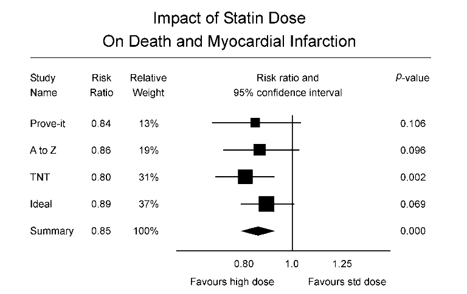

## Introduzione
La Figure \@ref(fig:fig1)  illustra una meta-analisi che mostra l'impatto delle statine ad alto dosaggio rispetto a quelle a dosaggio standard nella prevenzione della morte e dell'infarto miocardico (MI). Questa analisi è adattata da quella riportata da Cannon et al. e pubblicata sul Journalof the American College of Cardiology (2006). Il nostro obiettivo nel presentarla qui è quello di introdurre i vari elementi di una meta-analisi (la dimensione dell'effetto per ogni studio, il peso assegnato a ciascuna dimensione dell'effetto, la stima dell'effetto di sintesi e così via) e mostrare dove ciascuno si inserisce nello schema più ampio. Nei capitoli successivi, ognuno di questi elementi verrà esplorato in dettaglio.

```{r fig1, echo='FALSE', out.width='100%', fig.cap='Dosaggio elevato rispetto al dosaggio standard di statine (adattato da [@Cannon2006Aug]).'}

```

